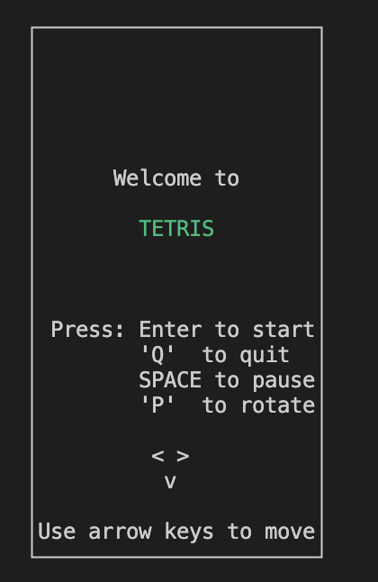
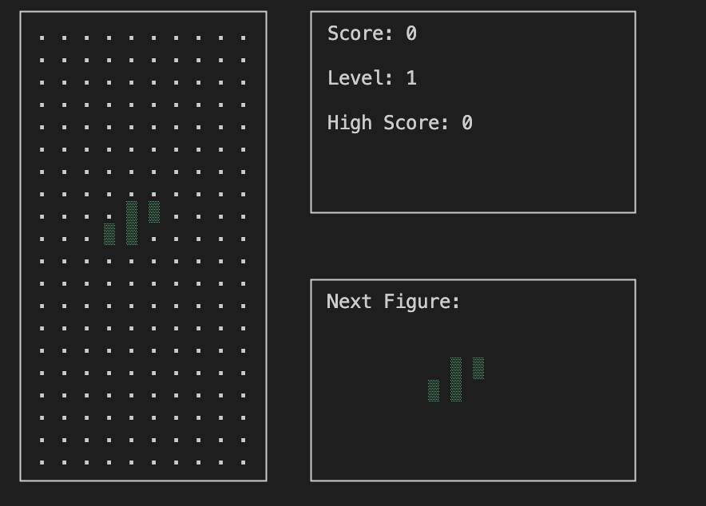
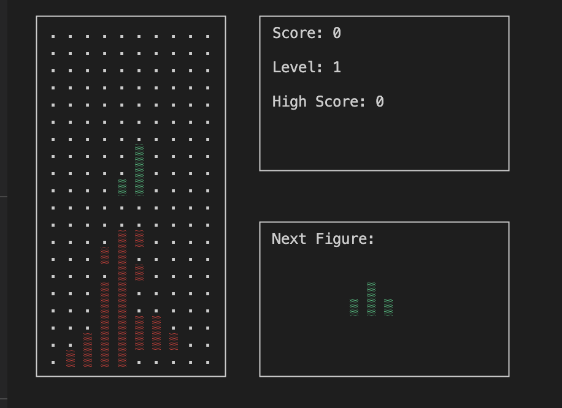

# BrickGame Tetris

## Introduction

In this project, a Tetris game was implemented using the C programming language. The main goal was to recreate the Tetris experience from the BrickGame handheld consoles of the 90s. The project consists of two main parts: a library implementing the game logic and a terminal interface that interacts with the user.

## General Information

### BrickGame

The BrickGame was a popular handheld console that featured many games, including Tetris, Tanks, Racing, Frogger, and Snake. The playing field was 10x20 "pixels" with a digital scoreboard displaying the player's progress and game status.

### Tetris

Tetris is a famous puzzle game where pieces of various shapes, called tetrominoes, fall from the top of the screen. The objective is to manipulate the falling blocks by moving them left, right, or rotating them to form a solid horizontal line without gaps. Once a line is complete, it disappears, and points are awarded. The game speeds up over time, increasing the challenge.

## Features

- Implemented core mechanics of the Tetris game.
- A terminal-based interface that provides real-time interaction.
- Scoreboard and level system.
- Speed increases as the game progresses.

## Controls

- **Left Arrow**: Move the tetromino to the left.
- **Right Arrow**: Move the tetromino to the right.
- **Up Arrow**: Rotate the tetromino.
- **Down Arrow**: Accelerate the fall of the tetromino.
- **Spacebar**: Drop the tetromino immediately to the bottom.

## Build Instructions

To build and run the project, follow these steps:

1. Clone the repository and navigate to the project folder:

    ```bash
    git clone <repository_url>
    cd <project_folder>
    ```

### Makefile Targets for Tetris Project

- **make all**: This target compiles all source files and builds the terminal version of the Tetris game using the `ncurses` library.
- **make clean**: This target removes all generated object files and executables, cleaning up the build environment.
- **make test**: This target compiles and runs unit tests to validate the game logic.
- **make install**: This target installs the Tetris game to a specified directory.
- **make uninstall**: This target removes the installed Tetris game from the system.
- **make dvi**: This target builds documentation for the project.
- **make dist**: This target packages the project for distribution.
- **make gcov_report**: This target generates a code coverage report in HTML format using `gcov` for the Tetris game logic.

## Screenshots

<table>
  <tr>
    <td></td>
    <td>
      <table>
        <tr>
          <td></td>
        </tr>
        <tr>
          <td></td>
        </tr>
      </table>
    </td>
  </tr>
</table>

